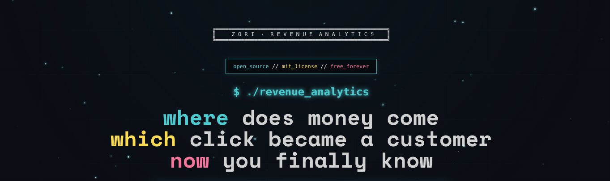

<p align="center">
  
</p>

<p align="center">
  <a href="https://github.com/ZoriHQ/zori/actions/workflows/tests.yml"></a>
  <a href="https://github.com/ZoriHQ/zori/releases/latest"></a>
  <a href="https://goreportcard.com/report/github.com/ZoriHQ/zori"></a>
  <a href="https://codecov.io/gh/ZoriHQ/zori"></a>
  <a href="https://github.com/ZoriHQ/zori/blob/main/LICENSE"></a>
  
</p>

# zori.

visitors → clicks → clarity.

---

## the problem?
you know visitors came.
you don't know what they did.
the gap between pageview and intent is dark.

## the answer.
zori watches every interaction.
classifies every click.
reveals patterns in behavior.

---

## what lives inside

```
visitor arrives (utm_source=magic)
     ↓
zori remembers
     ↓
clicks. scrolls. navigates.
     ↓
patterns emerge
     ↓
"ah, that's what they wanted"
```

**first touch.**
where they came from first
matters most

**every click.**
buttons. links. intentions.
classified. understood.

**traffic sources.**
referrers. utm params. campaigns.
truth in attribution.

---

## architecture (ascii version)

```
┌──────────┐     ┌──────────┐
│ browser  │────▶│ingestion │──┐
└──────────┘     └──────────┘  │
                                ▼
                 ┌──────────┐  NATS
                 │processor │◀─┘
                 └──────────┘
                       │
        ┌──────────────┼──────────────┐
        ▼              ▼              ▼
   ┌─────────┐  ┌──────────┐  ┌─────────┐
   │postgres │  │clickhouse│  │  redis  │
   └─────────┘  └──────────┘  └─────────┘
    (who you)    (what did)    (cache)
```

---

## quickstart recipe

**ingredients:**
- go 1.24+ (fresh)
- postgres 15+ (relational truth)
- clickhouse 24+ (time series speed)
- redis 7+ (memory)
- nats (message river)

**preparation:**

1. clone the repository
```bash
git clone https://github.com/ZoriHQ/zori.git && cd zori
```

2. season environment
```bash
cp example.env .env
# add your secrets to taste
```

3. rise the database
```bash
task migrate:up
```

4. serve hot
```bash
task server      # port 1323
task ingestion   # separate process port 1324
```

done. tracking begins.

---

## modes of being

**oss mode**
`ZORI_IS_OSS=true`
single tenant. your auth. your data.
freedom.

**cloud mode**
multi-tenant. clerk auth.
scale.

---

## questions → answers

**q: why track first touch only?**
a: first impression brought them. credit where due.

**q: visitor_id vs session_id?**
a: visitor persists forever. session = one sitting.

**q: why clickhouse?**
a: billions of events. millisecond aggregations. compression.

**q: what gets classified?**
a: every click. button/link/form/nav. patterns emerge.

---

## environment whispers

```bash
POSTGRES_URL=postgres://localhost:5432/zori
CLICKHOUSE_URL=http://localhost:8123
REDIS_ADDRS=localhost:6379
NATS_STREAM_URL=nats://localhost:4222

# choose your path
ZORI_IS_OSS=true           # or
CLERK_SECRET_KEY=sk_test_  # cloud
```

---

## dev commands

```bash
task test          # prove it works
task docs          # swagger at :8080/swagger
```

---

## license

MIT

---

built with go.
sees through clickhouse.
remembers in postgres.
messages through nats.

track clicks. understand intent.
